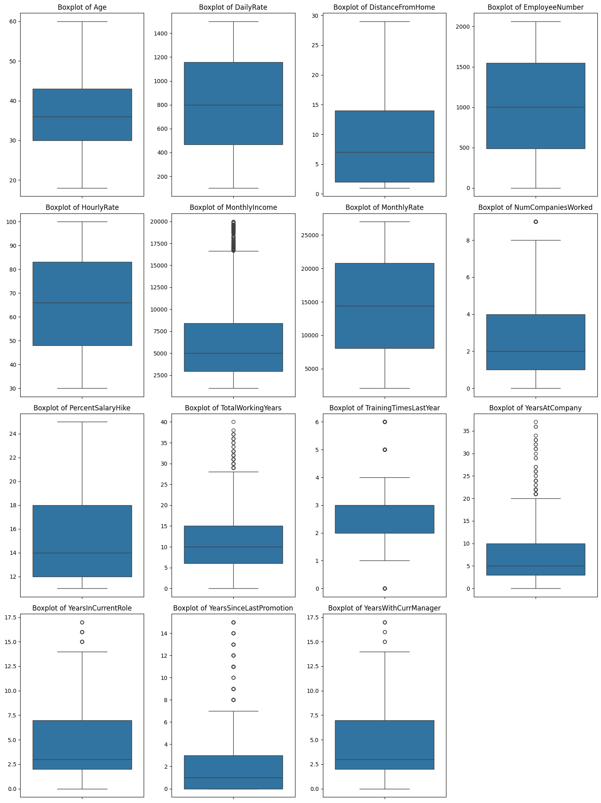
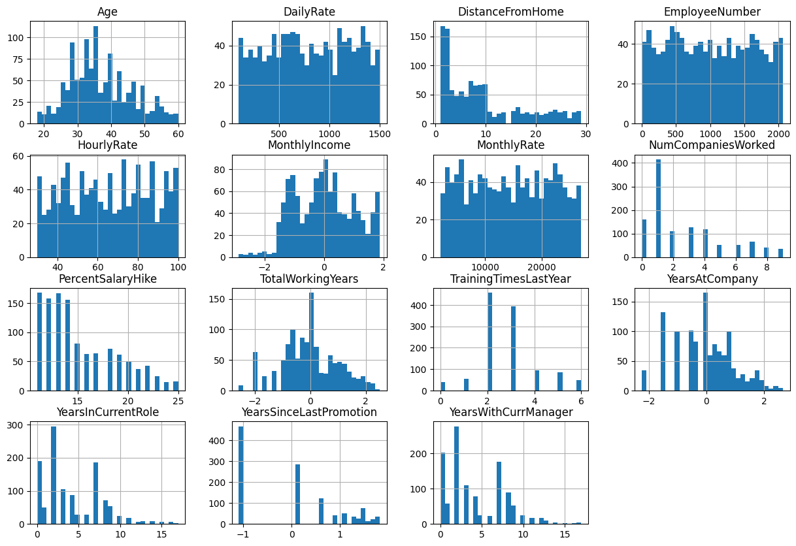

# Laporan Tugas 1 Statistics Machine Learning  
## Employee Attrition Prediction  
**Rochmat Pornomo Prasetya** — *5003231007*
**Raffly Isya Ramadhan** — *5003231135*
**Andyka Nabil Putra** — *5003231140*

---
## Daftar Isi

- [Domain Proyek: Attrition](#domain-proyek-attrition)
  - [Referensi](#referensi)
- [Business Understanding](#business-understanding)
  - [Problem Statements](#problem-statements)
  - [Goals](#goals)
  - [Solution Statements](#solution-statements)
  - [Project Benefits](#project-benefits)
- [Data Understanding](#data-understanding)
  - [Sumber Data](#sumber-data)
  - [Deskripsi Fitur](#deskripsi-fitur)
  - [Penjelasan Kontekstual Fitur](#penjelasan-kontekstual-fitur)
  - [Exploratory Data Analysis (EDA)](#exploratory-data-analysis---deskripsi-variabel)
    - [Missing Value & Outliers](#exploratory-data-analysis---menangani-missing-value-dan-outliers)
    - [Univariate Analysis](#exploratory-data-analysis---univariate-analysis)
    - [Multivariate Analysis](#exploratory-data-analysis---multivariate-analysis)
    - [Kesimpulan EDA](#kesimpulan-eda)
- [Data Preparation](#data-preparation)
  - [Label Encoding dengan Mapping pada Fitur Target](#1-label-encoding-dengan-mapping-pada-fitur-target)
  - [Splitting Dataset](#2-splitting-dataset)
  - [Feature Engineering, Data Cleaning and Preprocessing](#3-feature-engineering-data-cleaning-and-preprocessing)
- [Model Training, Comparison](#model-training-comparison)
  - [Model Selection](#1-model-selection)
- [Model Testing and Evaluation](#model-testing-and-evaluation)
  - [Data Test Predict](#1-data-test-predict)
  - [Best Model Evaluation](#2-best-model-evaluation)
    - [Classification Report](#classification-report)
    - [Metode Evaluasi Lanjutan](#metode-evaluasi-lanjutan)
    - [Confusion Matrix](#confusion-matrix)
    - [Plot ROC-AUC Curve](#plot-roc-auc-curve)
    - [Plot PR-AUC Curve](#plot-pr-auc-curve)
- [Save Best Model](#save-best-model)
- [Model Interpretation](#model-interpretation)
  - [Interpretation with SHAP Values](#1-interpretation-with-shap-values)
  - [Feature Importance](#2-feature-importance)
- [Attrition Result](#attrition-result)
- [Conclusions](#conclusions)
  - [Ringkasan Proyek](#ringkasan-proyek)
  - [Hasil dan Evaluasi Model](#hasil-dan-evaluasi-model)
  - [Penanganan Ketidakseimbangan Data](#penanganan-ketidakseimbangan-data)
  - [Interpretasi dan Validasi Model](#interpretasi-dan-validasi-model)
  - [Estimasi Nilai Finansial](#estimasi-nilai-finansial)
  - [Langkah Selanjutnya](#langkah-selanjutnya)

---
## **Domain Proyek: Keuangan**

<figure>
    <center></center>
</figure>

Manajemen sumber daya manusia merupakan salah satu aspek krusial dalam menjaga keberlanjutan dan daya saing perusahaan di era bisnis modern. Keberhasilan sebuah organisasi tidak hanya ditentukan oleh strategi bisnis dan inovasi produk, tetapi juga oleh kemampuan dalam mempertahankan karyawan yang berkompeten dan berprestasi. Fenomena tingginya tingkat attrition atau employee turnover menjadi tantangan yang signifikan karena dapat menimbulkan berbagai konsekuensi, mulai dari meningkatnya biaya rekrutmen dan pelatihan, terganggunya produktivitas, hingga menurunnya moral kerja tim [[1]](https://www.americanprogress.org/article/there-are-significant-business-costs-to-replacing-employees/?utm_source).
Banyak perusahaan kini berinvestasi dalam strategi retensi untuk menekan laju turnover, seperti peningkatan kepuasan kerja, penyesuaian beban kerja, dan pengembangan jalur karier yang lebih jelas [[2]](https://www.achievers.com/blog/employee-turnover-by-industry/?utm_source). Namun, memahami penyebab karyawan keluar tidaklah sederhana, karena keputusan tersebut dipengaruhi oleh berbagai faktor—baik dari sisi individu, seperti kepuasan dan keseimbangan kerja, maupun dari sisi organisasi, seperti lingkungan kerja dan kebijakan perusahaan [[3]](https://pmc.ncbi.nlm.nih.gov/articles/PMC9309793/?utm_source).
Untuk menghadapi tantangan ini, pendekatan berbasis data menjadi solusi yang menjanjikan. Dengan memanfaatkan data profil karyawan, lingkungan kerja, serta status kepegawaian, perusahaan dapat mengembangkan model prediktif yang mampu mengidentifikasi karyawan berisiko tinggi untuk keluar. Melalui penerapan teknik data science dan machine learning, organisasi tidak hanya dapat memprediksi potensi turnover dengan lebih akurat, tetapi juga memperoleh wawasan strategis mengenai faktor-faktor utama yang memengaruhi retensi. Pendekatan ini memungkinkan manajemen untuk mengambil langkah proaktif dalam menjaga stabilitas tenaga kerja, meningkatkan kepuasan karyawan, dan memperkuat daya saing jangka panjang perusahaan.


---

**Referensi:**

[1] American Progress (2012). *There Are Significant Business Costs to Replacing Employees
*. Retrieved from [https://www.americanprogress.org/](https://www.americanprogress.org/article/there-are-significant-business-costs-to-replacing-employees/?utm_source)  
[2] Achievers (2025). *Employee turnover by industry: The hidden cost of attrition in 2025*. Retrieved from [https://www.achievers.com/sg/](https://www.achievers.com/blog/employee-turnover-by-industry/?utm_source)  
[3] National Library of Medicine (2022). *Factors Affecting Employee’s Retention: Integration of Situational Leadership With Social Exchange Theory*. International Journal of Computer Applications, 166(1), 1–6. [https://pmc.ncbi.nlm.nih.gov/](https://pmc.ncbi.nlm.nih.gov/articles/PMC9309793/?utm_source)

---

## Business Understanding

### Problem Statements  
Dalam dunia bisnis modern, sumber daya manusia menjadi aset strategis yang menentukan keberlanjutan dan daya saing perusahaan. Namun, banyak organisasi menghadapi tantangan serius berupa meningkatnya jumlah karyawan yang meninggalkan perusahaan atau dikenal sebagai employee attrition (turnover). Tingginya tingkat turnover tidak hanya menyebabkan hilangnya talenta dan pengetahuan berharga, tetapi juga menimbulkan biaya besar bagi perusahaan, seperti rekrutmen, pelatihan, serta penurunan produktivitas dan moral kerja tim. Oleh karena itu, penting bagi manajemen untuk memahami faktor-faktor yang memengaruhi keputusan karyawan untuk bertahan atau keluar. Melalui analisis berbasis data yang mencakup profil karyawan, kondisi kerja, tingkat kepuasan, jam lembur, dan keseimbangan kerja–hidup, perusahaan dapat membangun model prediktif menggunakan pendekatan data science dan machine learning untuk memproyeksikan risiko attrition. Dengan demikian, organisasi dapat mengambil langkah preventif yang lebih tepat sasaran dalam meningkatkan retensi, kepuasan kerja, serta mengurangi kerugian finansial akibat tingginya tingkat pergantian karyawan.

Berdasarkan hal tersebut, berikut adalah pernyataan masalah yang diangkat:

- **Pernyataan Masalah 1:** Bagaimana mengidentifikasi faktor-faktor utama yang memengaruhi keputusan karyawan untuk meninggalkan perusahaan (employee attrition)?
- **Pernyataan Masalah 2:** Bagaimana membangun model prediksi yang mampu memperkirakan kemungkinan seorang karyawan akan keluar dengan tingkat akurasi yang tinggi?
- **Pernyataan Masalah 3:** Bagaimana memanfaatkan hasil analisis data untuk merumuskan strategi retensi yang efektif dalam meningkatkan kepuasan, keterikatan, dan loyalitas karyawan terhadap perusahaan?

### Goals  
Untuk menjawab pernyataan masalah di atas, tujuan proyek ini dirumuskan sebagai berikut:

- **Tujuan 1:** Melakukan eksplorasi dan analisis data historis karyawan untuk mengidentifikasi pola dan variabel yang memiliki korelasi tinggi terhadap perilaku employee attrition (keputusan karyawan untuk keluar). 
- **Tujuan 2:** Membangun model prediktif berbasis machine learning yang mampu memperkirakan probabilitas seorang karyawan akan meninggalkan perusahaan.
- **Tujuan 3:** Memberikan rekomendasi dan rencana aksi yang berbasis pada hasil prediksi model untuk meningkatkan retensi pelanggan dan memaksimalkan _Customer Lifetime Value_ (CLV).

### Solution Statements  
Untuk mencapai tujuan-tujuan tersebut, solusi yang akan diimplementasikan meliputi:

- **Eksperimen Berbagai Algoritma Klasifikasi:**  
  Membangun dan membandingkan performa beberapa algoritma seperti:
  - Decision Tree  
  - Random Forest  
  - LightGBM  

- **Optimasi Model dengan Hyperparameter Tuning:**  
  Menggunakan pendekatan seperti Bayesian Optimization dengan optuna untuk mendapatkan konfigurasi model terbaik.

- **Evaluasi Model dengan Metrik yang Relevan:**  
  Menggunakan metrik seperti:
  - Accuracy untuk mengukur prediksi keseluruhan  
  - Precision, Recall, F1-Score untuk menilai performa pada kelas churn  
  - ROC-AUC untuk mengevaluasi kemampuan model dalam membedakan kelas  
  - Confusion Matrix untuk melihat distribusi hasil prediksi

- **Analisis Fitur dan Visualisasi:**  
  Menyajikan visualisasi seperti feature importance dan correlation heatmap untuk menginterpretasikan fitur-fitur utama yang berkontribusi terhadap churn.

### Project Benefits  
Dengan implementasi solusi ini, manfaat utama yang diharapkan antara lain:

- **Penghematan Biaya:** Mengurangi biaya rekrutmen, pelatihan, dan onboarding karyawan baru dengan mempertahankan karyawan yang ada.  
- **Peningkatan Retensi Pelanggan:** Mengidentifikasi karyawan berisiko tinggi untuk keluar dan memungkinkan intervensi retensi yang tepat sasaran dan personal.
- **Perencanaan SDM yang lebih efisien:** Mengalokasikan sumber daya departemen HR untuk program retensi dan pengembangan secara lebih strategis berdasarkan data.
- **Perbaikan budaya perusahaan:** Mengidentifikasi akar penyebab attrition (seperti kepuasan kerja, work-life balance, atau hubungan dengan manajer) untuk membentuk lingkungan kerja yang lebih positif.  
- **Perlindungan Aset Pengetahuan:** Mencegah hilangnya pengetahuan institusional (institutional knowledge) dan keahlian kritis ketika karyawan berpengalaman meninggalkan perusahaan.

---

## Data Understanding

### Sumber Data  
Dataset yang digunakan dalam proyek ini diperoleh dari situs [Kaggle](www.kaggle.com/competitions/tugas-1-sml-a-2025/overview/citation). Dataset ini mencakup informasi tentang **1.467 karyawant**, yang mencatat berbagai aspek kondisi dan identitas yang mempresentasikan kecenderungan karyawan untuk melakukan attrition.

Dataset ini memiliki **35 fitur**, yang mencakup usia, frekuensi perjalanan, gaji harian, jarak tempat tinggal, tingkat pendidikan, tingkat kepuasan pekerjaan, dan lainnya. proyek ini bertujuan memprediksi employee attrition dimana sebesar 83,84% karyawan yang termasuk kategori attrition. Kondisi ketidakseimbangan kelas ini menjadi tantangan utama dalam membangun model prediktif yang akurat untuk mengidentifikasi pola-pola karyawan berisiko keluar dari perusahaan.

### Deskripsi Fitur

| Nama Fitur                         | Deskripsi                                                                 | Tipe Data    |
|------------------------------------|---------------------------------------------------------------------------|--------------|
| `id`                        | ID unik karyawan untuk identifikasi.                                                         | `int64`      |
| `Age`   | Usia karyawan.                | `int64`     |
| `BusinessTravel`                     |  Frekuensi perjalanan dinas karyawan.                                              | `int64`      |
| `DailyRate`                           | Gaji harian. (`M`/`F`)                                         | `object`     |
| `Department`                  | Departemen tempat karyawan. bekerja.                                                         | `int64`      |
| `DistanceFromHome`                  | Jarak tempat tinggal karyawan ke kantor.                  | `object`     |
| `Education`                   | STingkat pendidikan terakhir: 1 = Below College, 2 = College, 3 = Bachelor, 4 = Master, 5 = Doctor.                                               | `int64`     |
| `EducationField`                  | Bidang studi terakhir karyawan.                                     | `object`     |
| `EmployeeCount`                    | Jumlah karyawan (selalu 1 dalam dataset).                                                        | `int64`     |
| `EmployeeNumber`                   | Nomor unik karyawan dalam sistem. HR.                                   | `int64`      |
| `EnvironmentSatisfaction`         | JTingkat kepuasan terhadap lingkungan kerja: 1 = Low, 2 = Medium, 3 = High, 4 = Very High.                                     | `int64`      |
| `Gender`         | Jenis kelamin karyawan.                                     | `object`      |
| `HourlyRate`         | JUpah per jam.                                     | `int64`      |
| `JobInvolvement`         | Tingkat keterlibatan pekerjaan.                                     | `int64`      |
| `JobLevel`         | Level jabatan karyawan.                                     | `int64`      |
| `JobRole`         | Posisi/jabatan spesifik karyawan.                                     | `object`      |
| `JobSatisfaction`         | Tingkat kepuasan pekerjaan.                                     | `int64`      |
| `MaritalStatus`         | Status pernikahan karyawan.                                     | `object`      |
| `MonthlyIncome`         | Gaji bulanan karyawan.                                     | `int64`      |
| `MonthlyRate`         | Tarif bulanan karyawan.                                     | `int64`      |
| `NumCompaniesWorked`         | JJumlah perusahaan tempat karyawan pernah bekerja. sebelumnya.                                     | `int64`      |
| `Over18`         | Status usia di atas 18 tahun (selalu Y dalam dataset).                                     | `int64`      |
| `Overtime`         | Apakah karyawan sering lembur.                                     | `object`      |
| `PercentSalaryHike`         | Persentase kenaikan gaji tahunan terakhir.                                     | `int64`      |
| `PerformanceRating`         | Penilaian kinerja terakhir.                                     | `int64`      |
| `RelationshipSatifaction`         | Tingkat kepuasan terhadap hubungan kerja.                                     | `int64`      |
| `StandardHours`         | Jam kerja standar (selalu 80 dalam dataset).                                     | `int64`      |
| `StockOptionLevel`         | Level kepemilikan saham perusahaan.                                     | `int64`      |
| `TotalWorkingYears`         | Total tahun pengalaman kerja.                                     | `int64`      |
| `TrainingTimesLastYear`         | Jumlah pelatihan yang diikuti dalam setahun terakhir.                                     | `int64`      |
| `WorkLifeBalance`         | Tingkat keseimbangan kerja–hidup.                                     | `int64`      |
| `YearsAtCompany`         | Total tahun bekerja di perusahaan saat ini.                                     | `int64`      |
| `YearsInCurrentRole`         | Total tahun di posisi/jabatan saat ini.                                     | `int64`      |
| `YearsSinceLastPromotion`         | Tahun sejak promosi terakhir.                                     | `int64`      |
| `YearsWithCurrManager`         | Tahun bekerja dengan manajer saat ini.                                     | `int64`      |
| `Attrition`         | Target: apakah karyawan keluar dari perusahaan.                                     | `int64`      |


### [Exploratory Data Analysis] - Deskripsi Variabel

| Fitur                   |   count |            mean |        std |        min |         25% |           50% |          75% |         max |
|:------------------------|--------:|----------------:|-----------:|-----------:|------------:|--------------:|-------------:|------------:|
| Age                     |    1176 |    36.9983      |    9.17814 |   18       |   30        |    36         |    43        |    60       |
| DailyRate               |    1176 |   803.991       |  401.339   |  103       |  467.75     |   799.5       |  1157        |  1499       |
| DistanceFromHome        |    1176 |     9.35799     |    8.1798  |    1       |    2        |     7         |    14        |    29       |
| EmployeeNumber          |    1176 |  1015.83        |  599.657   |    1       |  487.75     |  1004.5       |  1547.25     |  2062       |
| HourlyRate              |    1176 |    65.5         |   20.3733  |   30       |   48        |    66         |    83        |   100       |
| MonthlyIncome           |    1176 |    -2.0558e-15  |    1.00043 |   -2.87116 |   -0.866219 |    -0.0105816 |     0.754662 |     1.8764  |
| MonthlyRate             |    1176 | 14390.2         | 7192.83    | 2094       | 8051        | 14373         | 20770.8      | 26999       |
| NumCompaniesWorked      |    1176 |     2.69303     |    2.48608 |    0       |    1        |     2         |     4        |     9       |
| PercentSalaryHike       |    1176 |    15.2398      |    3.67908 |   11       |   12        |    14         |    18        |    25       |
| TotalWorkingYears       |    1176 |    -4.47865e-16 |    1.00043 |   -2.5701  |   -0.605437 |     0.0392597 |     0.643954 |     2.49818 |
| TrainingTimesLastYear   |    1176 |     2.7602      |    1.25626 |    0       |    2        |     3         |     3        |     6       |
| YearsAtCompany          |    1176 |    -4.56173e-16 |    1.00043 |   -2.24665 |   -0.611588 |    -0.0828035 |     0.75437  |     2.65639 |
| YearsInCurrentRole      |    1176 |     4.23129     |    3.5695  |    0       |    2        |     3         |     7        |    17       |
| YearsSinceLastPromotion |    1176 |     1.51051e-17 |    1.00043 |   -1.09151 |   -1.09151  |     0.101344  |     0.908569 |     1.82449 |
| YearsWithCurrManager    |    1176 |     4.19643     |    3.5648  |    0       |    2        |     3         |     7        |    17       |
     
Berdasarkan hasil analisis data, profil **1.467** karyawan menunjukkan karakteristik kunci **usia rata-rata 37 tahun** dengan **masa kerja rata-rata 7 tahun** di perusahaan. Dari segi kompensasi, **gaji bulanan rata-rata Rp 6,5 juta** dengan **kenaikan gaji tahunan 15%**. Temuan penting mengungkap bahwa karyawan **hanya mengalami 1 kali promosi dalam 2 tahun terakhir**, dan rata-rata telah **bekerja di 2-3 perusahaan sebelumnya**. Pola ini mengindikasikan bahwa stagnasi karir dan riwayat mobilitas kerja dapat menjadi faktor prediktif yang signifikan untuk analisis employee attrition.

### Rata-rata Fitur per Kategori Attrition

| Fitur                   |             0 |            1 |
|:------------------------|--------------:|-------------:|
| Age                     |    37.7444    |    33.1263   |
| DailyRate               |   816.565     |   738.742    |
| DistanceFromHome        |     9.04665   |    10.9737   |
| EmployeeNumber          |  1009.8       |  1047.15     |
| HourlyRate              |    65.6734    |    64.6      |
| MonthlyIncome           |     0.0929293 |    -0.482254 |
| MonthlyRate             | 14321.5       | 14747.1      |
| NumCompaniesWorked      |     2.63996   |     2.96842  |
| PercentSalaryHike       |    15.2546    |    15.1632   |
| TotalWorkingYears       |     0.103021  |    -0.534622 |
| TrainingTimesLastYear   |     2.78195   |     2.64737  |
| YearsAtCompany          |     0.0931056 |    -0.483169 |
| YearsInCurrentRole      |     4.4929    |     2.87368  |
| YearsSinceLastPromotion |     0.0305439 |    -0.158507 |
| YearsWithCurrManager    |     4.46045   |     2.82632  |

Berdasarkan analisis perbandingan antara karyawan yang mengundurkan diri dan yang bertahan, terlihat pola yang signifikan. Karyawan yang keluar cenderung lebih muda dengan masa kerja di perusahaan yang lebih pendek. Mereka juga memiliki pendapatan bulanan yang lebih rendah dan jarak tempuh ke kantor yang lebih jauh. Faktor karir menunjukkan perbedaan mencolok dimana karyawan yang keluar memiliki lebih sedikit pengalaman kerja total, waktu di posisi saat ini yang lebih singkat, dan durasi bekerja dengan manajer yang sama yang lebih pendek. Temuan ini mengindikasikan bahwa karyawan yang lebih muda dengan prospek karir yang terbatas dan keterikatan organisasi yang rendah memiliki kecenderungan lebih besar untuk meninggalkan perusahaan.

### [Exploratory Data Analysis] - Menangani Missing Value dan Outliers

Dalam tahap awal pembersihan data, dilakukan pengecekan terhadap **duplikasi data** dan **missing value**. Hasilnya menunjukkan bahwa **tidak terdapat duplikasi data** maupun **missing value** di seluruh kolom fitur maupun target. Hal ini mengindikasikan bahwa dataset sudah lengkap dan tidak memerlukan teknik imputasi lebih lanjut.

| Fitur                    |   Missing |
|:-------------------------|----------:|
| id                       |         0 |
| Age                      |         0 |
| BusinessTravel           |         0 |
| DailyRate                |         0 |
| Department               |         0 |
| DistanceFromHome         |         0 |
| Education                |         0 |
| EducationField           |         0 |
| EmployeeNumber           |         0 |
| EnvironmentSatisfaction  |         0 |
| Gender                   |         0 |
| HourlyRate               |         0 |
| JobInvolvement           |         0 |
| JobLevel                 |         0 |
| JobRole                  |         0 |
| JobSatisfaction          |         0 |
| MaritalStatus            |         0 |
| MonthlyIncome            |         0 |
| MonthlyRate              |         0 |
| NumCompaniesWorked       |         0 |
| OverTime                 |         0 |
| PercentSalaryHike        |         0 |
| PerformanceRating        |         0 |
...
| YearsInCurrentRole       |         0 |
| YearsSinceLastPromotion  |         0 |
| YearsWithCurrManager     |         0 |
| Attrition                |         0 |

Berdasarkan hasil deteksi outlier menggunakan metode IQR, teridentifikasi beberapa variabel numerik yang mengandung outlier. Variabel MonthlyIncome memiliki 86 outlier, TrainingTimesLastYear mencatat outlier tertinggi sebanyak 174, dan TotalWorkingYears serta YearsAtCompany masing-masing memiliki 52 outlier. Variabel YearsSinceLastPromotion juga menunjukkan 85 outlier, sementara NumCompaniesWorked memiliki 36 outlier. 

Namun, terdapat beberapa variabel yang bersih dari outlier seperti Age, DailyRate, DistanceFromHome, EmployeeNumber, HourlyRate, MonthlyRate, dan PercentSalaryHike. Hasil ini mengindikasikan bahwa sebagian besar outlier terkonsentrasi pada variabel-variabel yang berkaitan dengan pengalaman kerja, kompensasi, dan perkembangan karir karyawan.

| Fitur                    |   Outlier |
|:-------------------------|----------:|
| id                       |         0 |
| Age                      |         0 |
| BusinessTravel           |         0 |
| DailyRate                |         0 |
| Department               |         0 |
| DistanceFromHome         |         0 |
| Education                |         0 |
| EducationField           |         0 |
| EmployeeNumber           |         0 |
| EnvironmentSatisfaction  |         0 |
| Gender                   |         0 |
| HourlyRate               |         0 |
| JobInvolvement           |         0 |
| JobLevel                 |         0 |
| JobRole                  |         0 |
| JobSatisfaction          |         0 |
| MaritalStatus            |         0 |
| MonthlyIncome            |         0 |
| MonthlyRate              |         0 |
| NumCompaniesWorked       |        36 |
| OverTime                 |         0 |
| PercentSalaryHike        |         0 |
| PerformanceRating        |       185 |
...
| YearsInCurrentRole       |        16 |
| YearsSinceLastPromotion  |         0 |
| YearsWithCurrManager     |        10 |
| Attrition                |       190 |

<figure>
    <center></center>
</figure>

Visualisasi melalui **boxplot** semakin memperjelas sebaran data dan keberadaan outlier di setiap fitur. Fitur seperti **TrainingTimeLastYear**, **MonthlyIncome**, dan beberapa fitur lain tampak memiliki sebaran yang lebar dengan banyak data berada di luar whisker (batas IQR), yang mengindikasikan variasi nilai ekstrim dalam data tersebut.

Meskipun demikian, outlier **tidak dihapus** dari dataset. Hal ini dilakukan untuk menjaga **keutuhan informasi**, mengingat data pencilan tersebut mencerminkan kondisi nyata seperti lonjakan transaksi pelanggan. Menghilangkan outlier justru berisiko menghilangkan pola penting dalam konteks analisis churn pelanggan.


### [Exploratory Data Analysis] - Univariate Analysis

#### Grafik 1: Distribusi Fitur Numerik
<figure>
    <center></center>
</figure>

- Sebagian besar nasabah berusia antara 40–50 tahun dan telah menggunakan layanan kartu kredit bank selama 36 bulan. Limit kredit nasabah cenderung rendah, dengan distribusi limit yang miring ke kanan — hanya sekitar 5% yang memiliki limit tinggi (sekitar 35.000). Hal serupa juga terjadi pada avg_open_to_buy dan avg_utilization_ratio, yang juga berpola skewed ke kanan.

- Bank perlu memperhatikan distribusi avg_utilization_ratio, karena sekitar 25% nasabah tidak menggunakan layanan sama sekali (rasio pemanfaatan = 0). Ini menjadi peluang bagi bank untuk meningkatkan pemanfaatan layanan agar pendapatan bertambah.

- Sekitar 25% nasabah juga memiliki total revolving balance sebesar nol, yang bisa menjadi indikator potensi churn. Karena proporsi nol pada variabel ini sama dengan utilization ratio, kemungkinan keduanya berkorelasi — ini akan dianalisis lebih lanjut.

- Distribusi jumlah dan nominal transaksi menunjukkan dua puncak, kemungkinan berbeda berdasarkan status churn. Banyak nasabah melakukan sekitar 40–80 transaksi dalam 12 bulan terakhir, dengan nominal umum sebesar 2.500 atau 5.000.

- Sekitar 80% nasabah memiliki setidaknya tiga produk dari bank.

#### Grafik 3: Distribusi Fitur Kategorik
<figure>
    <center></center>
</figure>

- 53% nasabah adalah perempuan, dan sebagian besar memiliki 2–3 tanggungan. Sebanyak 90% tidak aktif selama 1–3 bulan terakhir, sehingga perlu strategi untuk meningkatkan penggunaan layanan.

- Mayoritas nasabah menghubungi bank 2–3 kali setahun, berstatus menikah/lajang, lulusan sarjana, berpenghasilan < $40K, dan memiliki kartu blue.

- Beberapa kategori seperti 0 bulan tidak aktif dan 6 kali kontak sangat jarang muncul. Selain itu, kategori kartu tidak seimbang—93% nasabah memakai kartu blue. Ketidakseimbangan ini perlu diperhatikan saat pemodelan untuk menghindari overfitting.


## Data Preparation

###1. Feature Engineering, Data Cleaning and Preprocessing¶

Preprocessing untuk Model Berbasis Tree
- **Fitur Numerik**: <br/>
    Akan dilakukan transformasi karena untuk menyeragamkan skala dari berbagai fitur sehingga memiliki rentang nilai yang comparable. Tanpa scaling, fitur dengan skala besar (seperti MonthlyIncome) dapat mendominasi model machine learning dibandingkan fitur berskala kecil (seperti Age), yang menyebabkan model menjadi bias.

- **Fitur Kategorikal**. <br/>
    Akan diterapkan categorical encoding pada variabel dengan tipe **object*. Tanpa encoding, model tidak dapat memproses data kategorikal karena algoritma ML hanya bekerja pada data numerik.

**Variabel yang Akan Dihapus**
'JobLevel', 'YearsInCurrentRole', 'YearsWithCurrManager'

1. `JobLevel`, ‘YearsInCurrentRole’, ‘YearsWithCurrManager’: <br/>
    Akan dihapus karena memiliki korelasi positif tinggi, sehingga informasinya menjadi redundan.
2. 'EmployeeCount', 'Over18', 'StandardHours': <br/>
    Akan dihapus karena memiliki nilai yang sama semua setiap recordnya, sehingga tidak memiliki pengaruh untuk analisis.
2. 'id': <br/>
    Akan dihapus karena memiliki nilai yang unik untuk setiap recordnya, sehingga tidak berguna untuk analisis.

---

## Model Training, Comparison

### 1. Model Selection

Pada tahap pengembangan model prediksi **Employee Attrition**, digunakan 3 pendekatan yaitu pendekatan menggunakan **GridSearchCV**, pendekatan gabungan **XGBoost** dan **RandomizedSearchCV**, dan pendekatan yang terakhir adalah **stacking ensemble** yang mengombinasikan tiga model berbasis gradient boosting yaitu **XGBoost**, **LightGBM**, dan **CatBoost**  dengan model meta-learner **Logistic Regression** sebagai estimator akhir.
Ketiga algoritma dipilih karena masing-masing memiliki keunggulan berbeda dalam menangani data tabular dengan fitur numerik maupun kategorikal, serta dikenal memiliki performa tinggi untuk masalah klasifikasi biner.

#### GridSearchCV
```python
from sklearn.model_selection import GridSearchCV

rf_grid_search = GridSearchCV(
    estimator=rf,
    param_grid=param_grid,
    scoring='roc_auc',
    cv=3,
    verbose=2,
    n_jobs=-1
)
```
[GridSearchCV](https://scikit-learn.org/stable/modules/generated/sklearn.model_selection.GridSearchCV.html?utm_source) adalah metode dalam scikit-learn yang digunakan untuk melakukan pencarian parameter secara menyeluruh (exhaustive search) pada model pembelajaran mesin. Metode ini menguji semua kombinasi parameter yang ditentukan dalam `param_grid` dan mengevaluasi setiap kombinasi menggunakan cross-validation untuk menentukan kombinasi parameter yang memberikan performa terbaik. Hasilnya adalah model dengan hyperparameter yang dioptimalkan, yang dapat digunakan untuk prediksi lebih lanjut. GridSearchCV juga mendukung evaluasi dengan beberapa metrik dan dapat digunakan bersama dengan pipeline untuk mengoptimalkan parameter pada tahap transformasi dan klasifikasi secara bersamaan. 

#### RandomizedSearchCV
```python
from sklearn.model_selection import RandomizedSearchCV

xgb_random_search = RandomizedSearchCV(
    estimator=xgb,
    param_distributions=param_dist,
    n_iter=30,
    scoring='roc_auc',
    cv=3,
    verbose=2,
    random_state=42,
    n_jobs=-1
)
```
[RandomizedSearchCV](https://scikit-learn.org/stable/modules/generated/sklearn.model_selection.RandomizedSearchCV.html) adalah metode di scikit-learn untuk mencari hyperparameter terbaik pada model machine learning dengan cara sampling acak dari ruang parameter yang ditentukan, bukan mengecek semua kombinasi seperti GridSearchCV. Metode ini menggunakan cross-validation untuk menilai performa setiap kombinasi parameter yang dipilih secara acak sehingga proses tuning lebih cepat dan efisien, terutama jika jumlah parameter besar atau ruang parameter sangat luas. RandomizedSearchCV cocok ketika waktu komputasi terbatas atau ketika beberapa parameter memiliki pengaruh kecil terhadap performa model.


#### XGBoost
```python
from xgboost import XGBClassifier

xgb = XGBClassifier(
    n_estimators=800,
    learning_rate=0.03,
    max_depth=6,
    subsample=0.85,
    colsample_bytree=0.85,
    scale_pos_weight=2,
    reg_lambda=1.2,
    reg_alpha=0.2,
    eval_metric="auc",
    random_state=42
)

```
[XGBoost](https://xgboost.readthedocs.io/en/stable/python/python_api.html) adalah algoritma boosting berbasis pohon yang dibangun untuk efisiensi dan performa tinggi.Model ini mengoptimalkan fungsi kehilangan secara bertahap dengan menambahkan pohon baru yang memperbaiki kesalahan dari pohon sebelumnya. Penggunaan parameter seperti scale_pos_weight dan reg_lambda membantu menangani ketidakseimbangan kelas serta mencegah overfitting. XGBoost dikenal unggul dalam kestabilan prediksi dan kecepatan pelatihan.

#### LightGBM

````python
from lightgbm import LGBMClassifier

lgbm = LGBMClassifier(
    n_estimators=800,
    learning_rate=0.03,
    num_leaves=40,
    subsample=0.85,
    colsample_bytree=0.85,
    class_weight='balanced',
    random_state=42,
    metric='auc'
)

````
[LightGBM](https://lightgbm.readthedocs.io/en/latest/pythonapi/lightgbm.LGBMClassifier.html) merupakan algoritma gradient boosting yang dikembangkan oleh Microsoft, dengan keunggulan pada efisiensi memori dan waktu pelatihan. LightGBM menggunakan pendekatan leaf-wise tree growth, yang memperluas cabang dengan loss reduction tertinggi, menghasilkan model yang lebih akurat pada jumlah pohon yang sama. Parameter class_weight='balanced' membantu mengoreksi bias kelas minoritas, sedangkan num_leaves mengontrol kompleksitas model untuk menjaga keseimbangan antara bias dan varians.

#### CatBoost (Categorical Boosting)


````python
from catboost import CatBoostClassifier

cat = CatBoostClassifier(
    iterations=800,
    learning_rate=0.03,
    depth=6,
    l2_leaf_reg=2,
    eval_metric='AUC',
    verbose=0,
    random_seed=42
)

````
[CatBoost](https://catboost.ai/docs/en/) adalah algoritma gradient boosting yang dirancang khusus untuk menangani fitur kategorikal tanpa perlu encoding manual.
Dengan teknik ordered boosting dan target statistics, CatBoost mampu mengurangi overfitting serta meningkatkan stabilitas prediksi. Model ini bekerja sangat baik pada data tabular dengan kombinasi fitur numerik dan kategorikal, serta memiliki interpretabilitas yang lebih tinggi dibanding metode boosting lain.

Ketiga model ini digunakan dengan pengaturan parameter awal sebagai percobaan dasar

- Pada langkah ini, membandingkan kinerja model yang berbeda dengan menggunakan **_stratified k-fold cross validation_** untuk melatih masing-masing model dan mengevaluasi skor ROC-AUC. Stratified k-fold cross validation akan mempertahankan proporsi target pada setiap fold, menangani target yang tidak seimbang.

- _k-fold cross validation_ adalah teknik yang digunakan dalam _machine learning_ untuk menilai kinerja model. Teknik ini melibatkan pembagian dataset menjadi K subset, menggunakan K-1 untuk pelatihan dan satu untuk pengujian secara berulang. Hal ini membantu dalam memperkirakan kemampuan generalisasi model dengan mengurangi risiko _overfitting_ dan memberikan metrik kinerja yang lebih andal.

- Tujuan tahap ini adalah untuk memilih model terbaik untuk digunakan dalam _feature selection_, _hyperparameter tuning_, dan evaluasi model akhir. Untuk mendapatkan model terbaik ini, akan dievaluasi skor validasi rata-rata **roc-auc** tertinggi dan melihat trade-off bias-varians.

#### Tabel Perbandingan Performa Model

| Metrik | RandomForest (GridSearchCV)| XGBoost(RandomizedSearchCV) | Stacking Ensemble |
|--------|--------------|---------|------------------|
| ROC AUC (Val) | 0.793493 | 0.808087 | 0.948683 |
| Akurasi (Val) | 0.858844 | 0.857143 | 0.910074 |
| Recall (Val) | 0.157895 | 0.315789 | 0.805274 |

Dalam konteks prediksi attrition karyawan, evaluasi model menjadi sangat penting karena keputusan yang diambil berdasarkan model dapat memengaruhi strategi retensi, alokasi sumber daya, dan kebijakan HR. Dataset yang digunakan mencakup profil karyawan, lingkungan kerja, jabatan, beban kerja, jam lembur, kepuasan kerja, dan faktor lain yang memengaruhi keputusan karyawan untuk bertahan atau keluar. Dengan pemahaman ini, pemilihan model yang tepat sangat menentukan kualitas prediksi dan insight yang dapat diberikan kepada manajemen.
Berdasarkan hasil validasi dari tiga pendekatan yaitu RandomForest, XGBoost, dan Stacking Ensemble,terlihat bahwa Stacking Ensemble memiliki performa terbaik. Hal ini terlihat dari skor ROC-AUC validasi tertinggi sebesar 0,9487, yang menunjukkan kemampuan model dalam membedakan karyawan yang berisiko keluar dan mereka yang kemungkinan bertahan. Sementara RandomForest dan XGBoost memiliki akurasi yang cukup tinggi (0,8588 dan 0,8571), nilai recall mereka relatif rendah (0,158 dan 0,316), sehingga model tunggal cenderung melewatkan sebagian karyawan yang berisiko keluar.
Stacking Ensemble berhasil meningkatkan recall hingga 0,8053, membuat model lebih sensitif dalam mendeteksi potensi attrition. Di sisi lain, spesifisitas yang tinggi (0,97) menunjukkan bahwa model ini tetap akurat dalam mengidentifikasi karyawan yang akan bertahan. Dengan akurasi keseluruhan validasi sebesar 0,9101, model ini menunjukkan keseimbangan yang baik antara kemampuan mendeteksi churn dan mengurangi false positive, sehingga hasil prediksi dapat digunakan secara lebih aman untuk pengambilan keputusan strategis.
Secara keseluruhan, performa superior Stacking Ensemble mencerminkan kualitas data yang baik serta efektivitas pendekatan ensemble, di mana kombinasi beberapa model (XGBoost, LightGBM, CatBoost) mampu menangkap pola interaksi fitur yang kompleks. Hasil ini mendukung perusahaan dalam mengidentifikasi karyawan berisiko tinggi, merancang intervensi yang tepat, dan mengurangi biaya serta gangguan akibat attrition. Meskipun potensi peningkatan performa lebih lanjut melalui hyperparameter tuning relatif kecil, langkah tersebut tetap dapat dilakukan untuk menyempurnakan model dan memaksimalkan nilai prediktifnya.
---

## Model Testing and Evaluation

### 1. Data Test Predict

Dilakukan transform untuk preprocessing pada data test. Kemudian, dilakukan predict dan mendapatkan estimasi probabilitas attrition dari model untuk evaluasi.

### 2. Best Model Evaluation

#### Classification Report

| Class | Precision | Recall | F1-Score | Support |
|-------|-----------|--------|----------|---------|
| 0     | 0.9081      | 0.96   | 0.93     | 986    |
| 1     | 0.9147      | 0.81   | 0.86     | 493     |

- **Accuracy**: 0.91 (1479 data)
- **Macro Average**:
  - Precision: 0.91
  - Recall: 0.88
  - F1-Score: 0.90
- **Weighted Average**:
  - Precision: 0.91
  - Recall: 0.91
  - F1-Score: 0.91

#### Metode Evaluasi Lanjutan

- **Brier Score**: 0.06  
- **Gini Coefficient**: 0.90  
- **Kolmogorov-Smirnov (KS) Statistic**: 0.80

#### Confusion Matrix

#### Plot ROC-AUC Curve

#### Plot PR-AUC Curve


| No | Metrik     | Nilai     |
|----|------------|-----------|
| 0  | Accuracy   | 0.9101  |
| 1  | Precision  | 0.9147  |
| 2  | Recall     | 0.8053 |
| 3  | F1-Score   | 0.8565 |
| 4  | ROC-AUC    | 0.948683  |
| 5  | KS         | 0.800203  |
| 6  | Gini       | 0.897366  |
| 7  | PR-AUC     | 0.937852  |
| 8  | Brier      | 0.068189  |

Hasil akhir menunjukkan bahwa model memiliki performa yang sangat baik

- **Precision (0,9147)**: Dari seluruh karyawan yang diprediksi akan keluar (Attrition), **91,47%** benar-benar berisiko keluar. Dengan kata lain, model minim kesalahan dalam memprediksi karyawan yang berisiko resign, sehingga perusahaan bisa lebih percaya diri saat menargetkan intervensi.


- **Recall (0,8053)**: Model berhasil mengidentifikasi **80,53% karyawan yang benar-benar berisiko keluar**. Ini berarti sebagian besar karyawan yang berisiko resign dapat terdeteksi, sehingga langkah retensi dapat diarahkan secara tepat.


- **ROC-AUC (0,99948683):** Skor ROC-AUC sebesar 0,9487 menunjukkan kemampuan sangat baik model dalam membedakan antara karyawan yang bertahan dan yang keluar. Secara praktis, jika dipilih satu karyawan berisiko keluar dan satu yang bertahan secara acak, model akan memberi probabilitas lebih tinggi kepada karyawan yang benar-benar berisiko keluar dalam **95% kasus**.

Performa tinggi ini bukan disebabkan oleh kebocoran data, karena semua fitur tersedia pada saat prediksi, dan pembagian data dilakukan sebelum pemodelan. Hasil ini mencerminkan kualitas data yang baik, di mana variabel independen mampu membedakan dengan jelas antara karyawan yang bertahan dan yang berisiko keluar. Dengan model ini, organisasi dapat lebih efektif merancang strategi retensi, meminimalkan biaya turnover, dan menjaga produktivitas tim di era bisnis modern.

Selain itu, **kesamaan skor antara data train, test, dan validasi** menunjukkan bahwa model memiliki **kemampuan generalisasi yang andal**.

**Langkah Selanjutnya:**

Melakukan analisis terhadap distribusi probabilitas attrition yang diprediksi oleh model.


Dapat dilihat bahwa ada pemisahan yang jelas antara distribusi probabilitas yang diprediksi untuk attrition dan no attrition.


Grafik ini membuktikan bahwa model Anda sangat akurat, karena semakin tinggi prediksi risiko attrition (Desil 1 ke 10), semakin tinggi pula tingkat attrition karyawan yang sebenarnya terjadi.

---

## Save Best Model
```python
filename = '../model/LightGBM_model__v1.pkl'
```

---

## Model Interpretation

#### 1. Interpretation with SHAP Values

- Untuk menginterpretasikan hasil LightGBM, akan dianalisis nilai **SHAP**.  

- SHAP adalah library yang memungkinkan interpretasi hasil algoritma machine learning. Dengan SHAP, dapat dipahami dampak masing-masing fitur terhadap prediksi model individu, di mana **$ f(x) = E(f(x)) + SHAP $**.  

- Secara sederhana, nilai SHAP dari sebuah fitur (seberapa besar pengaruhnya terhadap prediksi individu) adalah penjumlahan berbobot kontribusi marjinal dengan mempertimbangkan semua kemungkinan kombinasi fitur (**feature coalitions**).  

- **Feature coalition** adalah kelompok fitur, dan nilainya merupakan prediksi model individu yang hanya menggunakan fitur-fitur dalam kelompok tersebut. Kontribusi marjinal dari sebuah fitur adalah perbedaan antara nilai prediksi untuk kombinasi fitur dengan dan tanpa fitur tersebut. Nilai kontribusi marjinal dijumlahkan untuk semua kemungkinan kombinasi dengan dan tanpa fitur tersebut. Bobotnya didasarkan pada probabilitas fitur yang sedang dihitung nilai SHAP-nya untuk berada dalam kombinasi tersebut.

```python
import shap

explainer = shap.Explainer(lgb_clf)
shap_values = explainer(X_test_selected)
```

- Terdapat **35 variabel** dalam model, dan untuk setiap observasi, masing-masing memiliki **nilai SHAP** yang menggambarkan kontribusinya terhadap prediksi.

- Dalam kasus klasifikasi biner, hasil prediksi dinyatakan dalam bentuk **log-odds**. Pada visualisasi berikut, $E(f(X))$ merepresentasikan **nilai rata-rata prediksi dalam skala log-odds**.

- **Log-odds** sendiri merupakan logaritma dari *odds*, yaitu rasio antara probabilitas suatu kejadian terjadi dengan tidak terjadi. Penggunaan logaritma ini menjadikan skala prediksi lebih linear dan stabil.

- **Nilai SHAP positif** menunjukkan bahwa suatu fitur meningkatkan nilai log-odds, yang berarti juga meningkatkan **kemungkinan karyawan untuk attrition**, sedangkan **nilai negatif** menurunkan probabilitas tersebut.

- Untuk mengubah log-odds menjadi **probabilitas attrition**, digunakan fungsi logistik (sigmoid) sebagai berikut:

<center>

$$
\text{sigmoid}(x) = \frac{1}{1 + e^{-x}}
$$

</center>

- Visualisasi **waterfall plot** digunakan untuk menunjukkan **kontribusi masing-masing fitur terhadap prediksi attrition** baik untuk observasi positif (attrition) maupun negatif (no attrition).

#### Sampel salah satu pelanggan


- Karyawan ini diprediksi akan attrition (keluar), dengan probabilitas attrition yang sangat tinggi yaitu 95.81% (transformasi dari nilai log-odds akhir $f(x) = 3.129$ melalui fungsi logistik).

- Faktor pendorong utama adalah JobSatisfaction (Kepuasan Kerja) dan StockOptionLevel (Level Opsi Saham) yang keduanya bernilai -1 (nilai rendah setelah di-scale/encode). Masing-masing fitur ini meningkatkan log-odds attrition sebesar +0,89. Ini sangat mengindikasikan bahwa ketidakpuasan kerja dan ketiadaan opsi saham adalah pemicu utama karyawan ini ingin keluar.

- Faktor kuat lainnya adalah NumCompaniesWorked (Jumlah Perusahaan Tempat Bekerja) yang bernilai 1.667 (nilai tinggi setelah di-scale), yang meningkatkan log-odds sebesar +0,80. Ini bisa ditafsirkan bahwa karyawan ini memiliki riwayat berpindah kerja yang sering, sehingga cenderung untuk pindah lagi.

- Sebaliknya, satu-satunya faktor signifikan yang menahan karyawan ini adalah OverTime (Lembur) yang bernilai 0.111 (kemungkinan besar berarti "Tidak Lembur" setelah di-encode), yang menurunkan log-odds attrition sebesar 0,42. Ini menunjukkan bahwa fakta bahwa dia tidak lembur adalah satu-satunya alasan kuat untuk bertahan, namun pengaruhnya kalah telak oleh akumulasi faktor-faktor pendorong keluar lainnya..

### 2. Feature Importance


- Seperti yang terlihat jelas, OverTime (Lembur) merupakan fitur yang paling penting dengan selisih yang sangat besar. Fitur penting berikutnya adalah JobRole (Peran Pekerjaan) dan WorkLifeBalance (Keseimbangan Kehidupan Kerja).

- Hal ini sangat masuk akal, dan seperti yang mungkin telah terlihat pada analisis eksplorasi data (EDA), variabel-variabel ini sering menjadi pendorong utama keputusan karyawan. OverTime dan WorkLifeBalance kemungkinan menunjukkan perbedaan yang sangat jelas antara karyawan yang attrition (keluar) dan mereka yang bertahan.

- Grafik ini juga menyoroti bahwa sebagian besar fitur lainnya (dari BusinessTravel ke bawah) memiliki dampak yang sangat kecil terhadap performa model, di mana nilai "Penurunan Rata-rata Skor AUC" mereka mendekati nol. Ini mengindikasikan bahwa model Anda sangat bergantung pada ketiga fitur teratas tersebut untuk membuat prediksi..  

- Sekarang, melalui **beeswarm plot**, kita dapat mengamati hubungan antara fitur-fitur dan prediksi model.


- Terlihat bahwa nilai tinggi (ditunjukkan oleh warna merah) pada OverTime memiliki dampak positif terhadap log-odds attrition, dan, akibatnya, terhadap probabilitas attrition, sedangkan nilai rendah (biru) memiliki dampak negatif.

- Selain itu, nilai rendah (biru) pada JobSatisfaction cenderung memberikan dampak positif terhadap log-odds attrition, dan, akibatnya, probabilitas attrition, sedangkan nilai tinggi (merah) cenderung memiliki dampak negatif.

---

## Attrition Result

**Estimasi Dampak Finansial Model terhadap Perusahaan**

Untuk menunjukkan nilai tambah dari analisis ini, akan disajikan performa model dalam bentuk estimasi keuntungan finansial (penghematan biaya) bagi pihak perusahaan. Analisis ini didasarkan pada confusion matrix dan data yang tersedia saat ini.

**Asumsi Dasar:**
Karena tidak tersedia data spesifik mengenai biaya turnover aktual, digunakan asumsi umum bahwa biaya kehilangan seorang karyawan (rekrutmen, pelatihan, kehilangan produktivitas) dan biaya retensi (bonus, kenaikan gaji) dapat diestimasi berdasarkan Gaji Bulanan (MonthlyIncome) karyawan tersebut.

**Komponen Biaya dan Manfaat yang Diperhitungkan:**

- **Biaya Retensi untuk False Positive (FP):**  
  Karyawan yang salah diprediksi akan attrition namun sebenarnya tidak. Perusahaan akan mengeluarkan biaya retensi (misal, bonus) yang tidak perlu.  
  *Asumsi:* Biaya retensi sebesar 1.0x Gaji Bulanan.

- **Biaya Turnover dari False Negative (FN):**  
  Karyawan yang benar-benar attrition namun gagal terdeteksi oleh model. Perusahaan menanggung biaya turnover penuh. Asumsi: Biaya turnover (rekrutmen, hilang produktivitas, dll.) sebesar 6.0x Gaji Bulanan.

- **Keuntungan Bersih dari True Positive (TP):**  
  Karyawan yang diprediksi attrition dan berhasil dipertahankan. Perusahaan berhasil menghindari biaya turnover penuh, namun tetap mengeluarkan biaya retensi. Asumsi: Keuntungan bersih (biaya turnover yang dihindari dikurangi biaya retensi) adalah 5.0x Gaji Bulanan.

**Langkah Selanjutnya:**
Dilakukan perhitungan proyeksi keuntungan bersih (penghematan biaya) berdasarkan nilai-nilai di atas menggunakan dataset aktual (non-SMOTE), dengan mempertimbangkan jumlah karyawan pada setiap kategori confusion matrix (TP, FP, FN) dan MonthlyIncome mereka.

Model menghasilkan estimasi keuntungan bersih (penghematan biaya) maksimal sekitar $4.601.685. Hasil ini dicapai dengan menggunakan threshold probabilitas optimal 0.13. Pada titik ini, model merekomendasikan intervensi (strategi retensi) pada 190 karyawan, dan yang terpenting, tidak ada karyawan yang keluar yang gagal terdeteksi (FN = 0).

Jumlah penghematan sebenarnya akan bergantung pada kebijakan manajemen SDM saat mengimplementasikan strategi retensi untuk karyawan berdasarkan probabilitas attrition yang diprediksi.

Sebagai contoh, seperti yang disebutkan dalam output, jika perusahaan ingin bersikap lebih konservatif dengan mengurangi pengeluaran yang terkait dengan False Positive (memberi bonus pada karyawan yang sebenarnya tidak akan keluar), perusahaan dapat menargetkan karyawan dengan probabilitas attrition yang lebih tinggi (menaikkan threshold), meskipun hal ini dapat sedikit memengaruhi potensi keuntungan bersih total.

Namun demikian, untuk tujuan estimasi dan sebagai dasar pengambilan keputusan, kita telah memastikan bahwa proyek ini sangat layak untuk dilakukan dan berpotensi memberikan penghematan biaya yang sangat signifikan bagi perusahaan.

## Conclusions

### Ringkasan Proyek
Dalam proyek ini, telah dikembangkan sebuah model klasifikasi ensemble berbasis Stacking (menggabungkan XGBoost, LightGBM, dan CatBoost) untuk memprediksi probabilitas karyawan yang akan melakukan attrition (keluar) dari perusahaan. Tujuan utama dari pengembangan model ini adalah untuk menghasilkan prediksi yang akurat terhadap potensi turnover, mengidentifikasi faktor-faktor utama yang memengaruhi keputusan karyawan untuk berhenti, serta menyusun rekomendasi aksi yang dapat diimplementasikan guna meminimalkan tingkat turnover. Dengan demikian, pihak manajemen SDM dapat menyusun strategi retensi yang lebih efektif dan tepat sasaran, mengingat bahwa mempertahankan karyawan berprestasi umumnya jauh lebih ekonomis dibandingkan biaya rekrutmen, pelatihan, dan kehilangan produktivitas.

### Hasil dan Evaluasi Model
Permasalahan bisnis yang diangkat telah berhasil diselesaikan dengan sangat baik. Model stacking yang dibangun mampu mencapai Overall ROC-AUC yang sangat tinggi. Nilai AUC yang tinggi ini menunjukkan bahwa model memiliki kemampuan klasifikasi yang nyaris sempurna, yakni mampu memberikan probabilitas attrition yang lebih tinggi kepada karyawan yang benar-benar keluar dibandingkan dengan yang tidak. Selama tahap Exploratory Data Analysis (EDA) dan divalidasi oleh interpretasi model, telah berhasil diidentifikasi beberapa faktor utama (seperti OverTime dan JobRole) yang menjadi penyebab attrition.

### Penanganan Ketidakseimbangan Data
Dalam menghadapi ketidakseimbangan pada variabel target (Attrition), telah diterapkan strategi oversampling menggunakan SMOTE (Synthetic Minority Over-sampling Technique). Pendekatan ini digunakan untuk membuat dataset latih (X_res, y_res) yang lebih seimbang sebelum melatih model ensemble. Selain itu, Stratified K-Fold Cross-Validation digunakan selama proses validasi untuk memastikan bahwa setiap fold memiliki representasi kelas (keluar vs. bertahan) yang proporsional, sehingga evaluasi model menjadi lebih reliabel.

### Interpretasi dan Validasi Model
Model telah diinterpretasikan dengan menggunakan dua teknik utama: Permutation Importance (untuk evaluasi global) dan SHAP (SHapley Additive exPlanations) (untuk evaluasi individual). Hasil dari Permutation Importance mengonfirmasi bahwa OverTime adalah fitur paling berpengaruh secara signifikan. Analisis SHAP pada level individu (seperti waterfall plot) memberikan kejelasan tentang bagaimana kombinasi fitur-fitur seperti JobSatisfaction, StockOptionLevel, dan NumCompaniesWorked berkontribusi pada prediksi log-odds untuk satu karyawan spesifik.

### Estimasi Nilai Finansial
Berdasarkan estimasi dampak finansial, proyek ini memiliki potensi memberikan penghematan biaya bersih (Net Benefit) sekitar $4.601.685. Estimasi ini didasarkan pada asumsi biaya turnover (setara 6x gaji bulanan) dan biaya retensi (setara 1x gaji bulanan) yang dihitung dari MonthlyIncome. Analisis ini juga menunjukkan bahwa dengan menyesuaikan threshold probabilitas (ke 0.13), perusahaan dapat memaksimalkan keuntungan bersih dan secara teoretis mengeliminasi seluruh False Negative (FN = 0). Besarnya nilai manfaat aktual tentu akan sangat tergantung pada struktur biaya SDM yang sebenarnya serta implementasi strategi retensi oleh manajemen.

### Langkah Selanjutnya
Tahap selanjutnya dari proyek ini adalah deploy model ke dalam lingkungan produksi dengan menerapkan prinsip Continuous Integration/Continuous Deployment (CI/CD). Langkah ini bertujuan untuk memastikan proses otomatisasi yang berkelanjutan serta pemeliharaan model yang efisien dan dapat diandalkan di lingkungan operasional, misalnya dengan memberikan "skor risiko attrition" pada dasbor SDM secara real-time.

